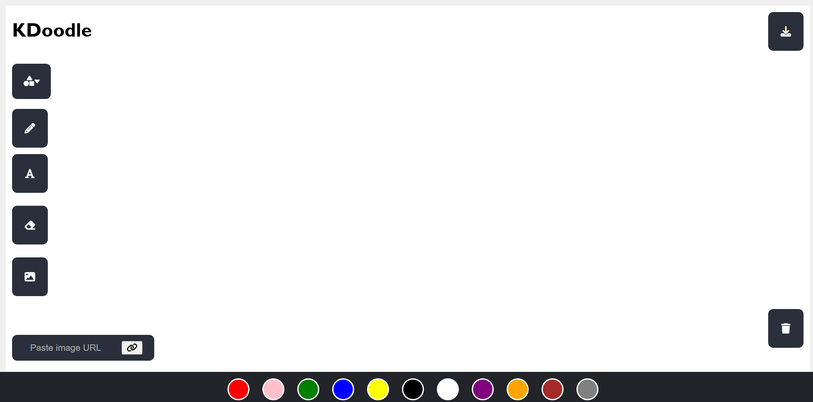

# KDoodle Drawing Web App

KDoodle is a modern web-based drawing application that combines the simplicity of MS Paint with advanced features like high-quality PDF export and image import capabilities. The app is designed for both mouse and touch input, featuring a clean, intuitive interface.

# Kdoole Screenshot


## Key Features
-  Freehand drawing with customizable colors
- Shape tools (rectangle, circle, triangle, line)
-  Text insertion with real-time preview
- Image import from file or URL
-  Dual-mode PDF export (server/client)
- Touch-device support

## Tech Stack
- HTML, CSS, JavaScript (Vanilla JS)
- Node.js and Express.js for server-side PDF processing
- pdf-lib for high-quality server-side PDF generation
- jsPDF for client-side PDF fallback
- Font Awesome for icons (loaded via CDN)

## Detailed Features

### Drawing Tools
- **Freehand Drawing**: Smooth, responsive drawing with adjustable colors
- **Shape Tools**: Quick-access dropdown for rectangles, circles, triangles, and lines
- **Text Tool**: Direct on-canvas typing with real-time preview
- **Eraser**: Precision erasing with adjustable brush size
- **Clear Canvas**: One-click canvas clearing

### Image Handling
- **File Import**: Drag-and-drop or click-to-upload images
- **URL Import**: Paste image URLs to import from the web
- **Image Manipulation**: Drag to reposition imported images
- **Multi-Image Support**: Import multiple images to create compositions

### PDF Export System
The app features a dual-mode PDF export system for maximum flexibility:

**1. High-Quality Mode (Server)**
- Runs when Node.js server is active
- Uses pdf-lib for professional-grade PDFs
- Best for high-resolution exports
- Maintains image quality and vector shapes

**2. Offline Mode (Client)**
- Automatic fallback when server isn't available
- Uses jsPDF for client-side generation
- Works without internet connection
- Quick and convenient for basic exports

## Quick Start Guide

### 1. Basic Setup (Client-Only Mode)
1. Clone the repository
2. Open `index.html` in a modern browser
3. Start drawing! No additional setup needed

### 2. Server Setup (For High-Quality PDF Export)
```bash
# Install Node.js dependencies
npm install

# Start the server
node server.js

# Server will be running at:
# http://localhost:3000
```

### Server Requirements
- Node.js 14.x or higher
- NPM 6.x or higher
- Required packages (automatically installed):
  - express
  - cors
  - body-parser
  - pdf-lib

## User Guide

### Drawing Tools
1. **Pen Tool**
   - Click the pen icon or press `P`
   - Select color from the palette
   - Draw freely on canvas

2. **Shapes**
   - Click the shapes dropdown
   - Select desired shape
   - Shape appears at cursor position
   - Uses currently selected color

3. **Text Tool**
   - Click text icon or press `T`
   - Click anywhere to start typing
   - Press Enter to finish

4. **Eraser**
   - Click eraser icon or press `E`
   - Drag to erase
   - Double-click eraser for size options

### Image Operations
1. **From Local File**
   ```
   1. Click image icon
   2. Select file from computer
   3. Drag to position
   ```

2. **From URL**
   ```
   1. Paste URL in image field
   2. Click link icon
   3. Image appears on canvas
   ```

### Exporting Your Work
1. **High-Quality Export (Server Mode)**
   ```
   1. Ensure server is running
   2. Click export button
   3. Save high-quality PDF
   ```

2. **Quick Export (Client Mode)**
   ```
   1. Click export button
   2. PDF generates in browser
   3. Auto-downloads
   ```

## Troubleshooting

### Common Issues
1. **PDF Export Not Working**
   - Check if server is running
   - Verify node modules are installed
   - Clear browser cache

2. **Image Import Issues**
   - Ensure URL is accessible
   - Check file format (PNG/JPG/GIF)
   - Verify file size < 5MB

Exporting as PDF
Use the "Export as PDF" button in the app. The client will send your canvas to the backend, which will generate and return a high-resolution PDF.
 
## File Structure
index.html — Main HTML file, contains the UI and canvas.
style.css — All styles for layout, buttons, dropdowns, and color palette.
canvas.js — Main JavaScript logic for drawing, shapes, text, erasing, image import, export, and tool state management.

## Dependencies
Font Awesome for icons (loaded via CDN)
jsPDF for PDF export (loaded via CDN)

## Notes
Only one tool (pen, eraser, or text) can be active at a time.
Color selection only works when the pen tool is active.
Imported images (from file or URL) are movable by dragging.
The app is responsive and works on both desktop and touch devices.

## License
This project is for educational/demo purposes.
